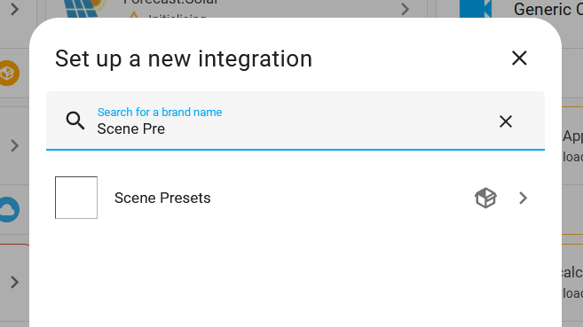
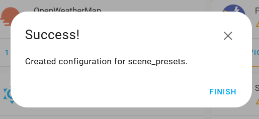

# Scene Presets

This custom_component is an offensively low effort way of implementing the Philips Hue Scenes in Home Assistant without
the Hue bridge due to the whole Hue Account kerfuffle.

The code for the most part has been written by ChatGPT which greatly amazes me. Though, that should also set your expectations.
I'm not sure where this will be going and if this will be going anywhere at all but we'll see.
For now, think of it as a proof-of-concept.

Installations as a HACS custom repository should be possible.
You can then set it up via a config flow that does nothing. 👍

## Presets

This component provides all the scene presets that were available in the Hue App scene gallery on 2023-09-28.
These have been manually extracted in a clean-room way by setting a group of lights to a scene and then noting the different x,y values + its name.
Thanks again to @coderph0x!

Check out the [./assets/](./assets/Readme.md) folder for a list with all presets available.

## Screenshots

