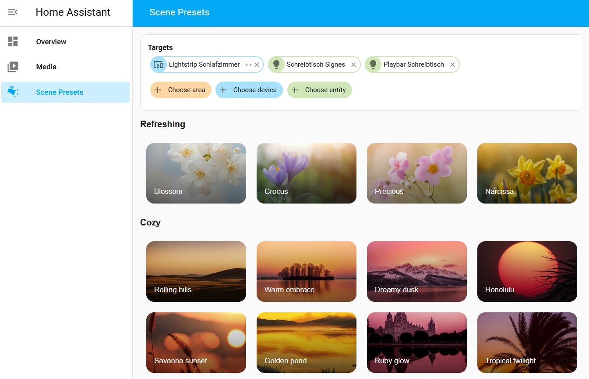

# Scene Presets

This custom_component is an offensively low effort way of implementing the Philips Hue Scenes in Home Assistant without
the Hue bridge due to the whole Hue Account kerfuffle.

Please be aware that this is still very much in a slowly evolving early WIP state.

Installations as a HACS custom repository should be possible.
You can then set it up via a config flow that does nothing. 👍

## Usage

For basic usage, open the Home Assistant sidebar, navigate to "Scene Presets", select your lights and then click on a preset image to apply it.

For advanced usage, use the Home Assistant DevTools and call the services provided by the component directly.
This will change in the future

## Screenshots

## Presets

This component provides all the scene presets that were available in the Hue App scene gallery on 2023-09-28.
These have been manually extracted in a clean-room way by setting a group of lights to a scene and then noting the different x,y values + its name.
Thanks again to @coderph0x!

Check out the [assets](./custom_components/scene_presets/assets/Readme.md) folder for a list with all presets available.