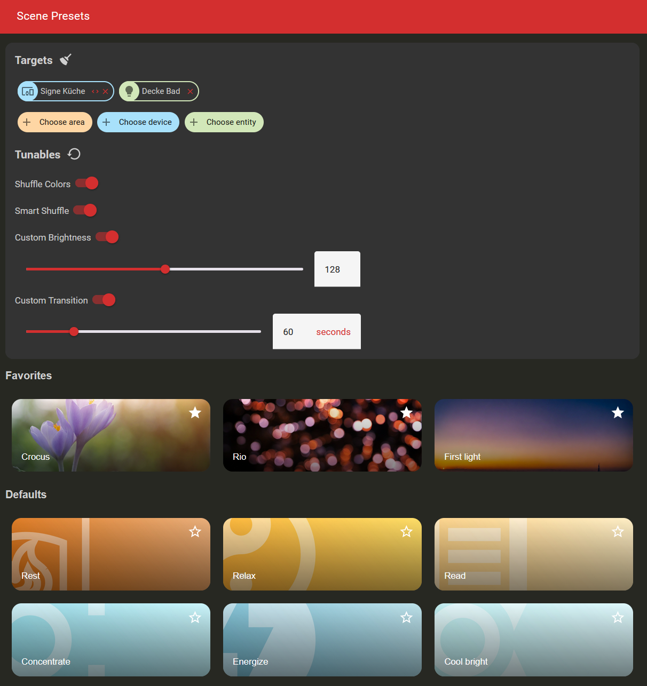
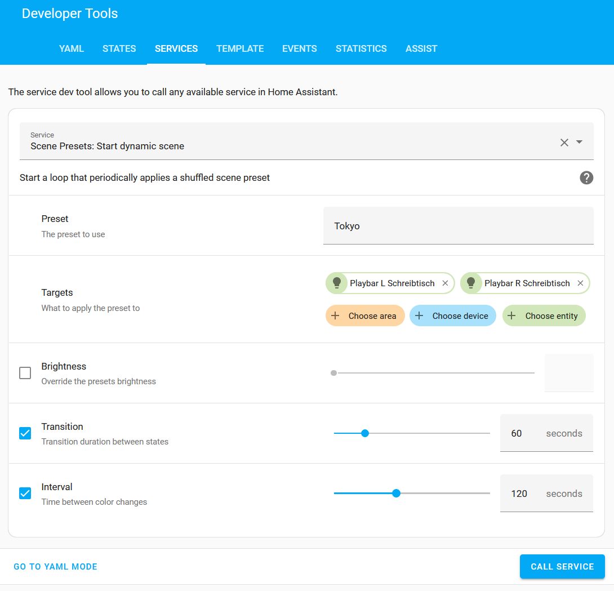
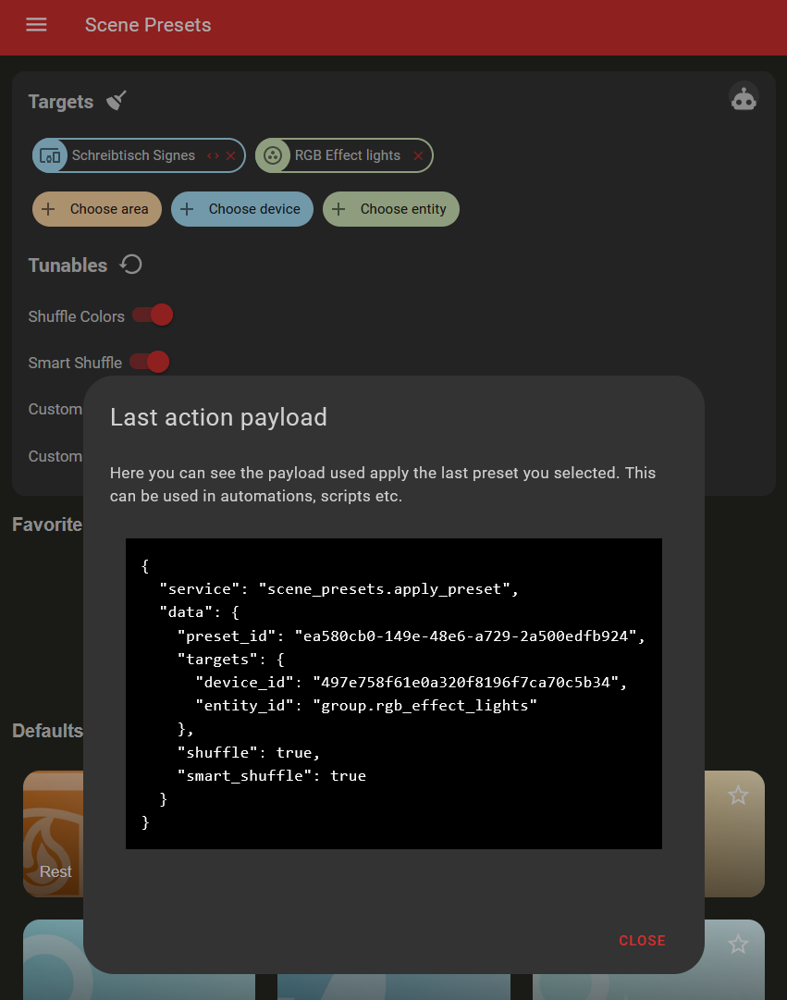

    

 

This custom_component is an implementation of an idea not all too dissimilar to what the Philips Hue app calls Scenes.
Apart from that though, it has nothing to do with Hue. No bridge required.

Everything has been implemented entirely inside this custom_component, meaning that it works with every `light` entity.
No vendor restrictions. No need for special bridges.
And, most importantly, no account required :-)

## Screenshots

## Installation

1. Add the repository as a custom repository of type integration in HACS: https://hacs.xyz/docs/faq/custom_repositories/
2. Restart Home Assistant
3. Navigate to Settings > Devices & Services
4. Click Add integration
5. Search for Scene Presets
6. Click on it and follow the wizard 🧙

You should now have a new item in your sidebar.

## Usage

For basic usage, open the Home Assistant sidebar, navigate to "Scene Presets", select your lights and then click on a preset image to apply it.

For advanced usage, use the Home Assistant DevTools and call the services provided by the custom_component directly.
Preset IDs can be found in the overview here: [assets](./custom_components/scene_presets/assets/Readme.md)

You can also get the payload for the service call for the preset you applied last by clicking on the robot icon:

## Docs

Check out the [./docs/](./docs) folder for an explanation on what Smart Shuffle is and instructions for developers on how
to add their own custom presets locally.

## Further questions?
[scene_presets Telegram group](https://t.me/+RTEq2nwI9-MwNWYy)

## Presets

This component provides all the scene presets that were available in the Hue App scene gallery on 2023-09-28.
These have been manually extracted in a clean-room way by setting a group of lights to a scene and then noting the different x,y values + its name.
Thanks again to @coderph0x!

Check out the [assets](./custom_components/scene_presets/assets/Readme.md) folder for a list with all presets available.