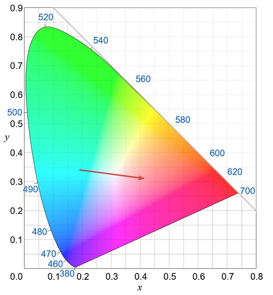
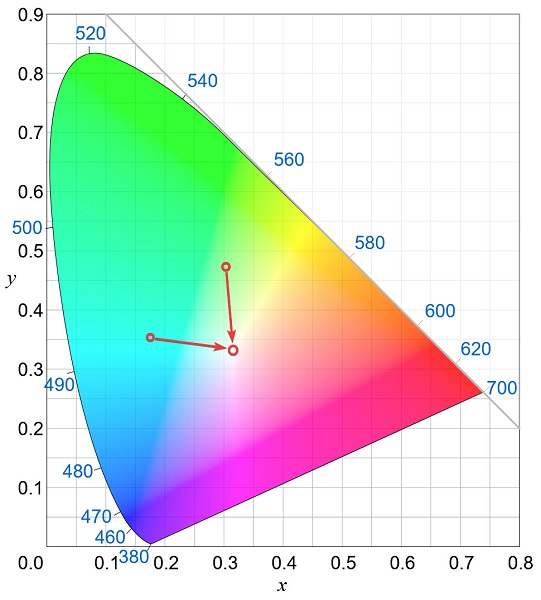

# What is Smart Shuffle?

With hue (and probably other vendors as well), when you apply a random color with a transition (especially long ones), it can happen that the light turns to white and brightly illuminates the otherwise rather dark and moody room.

This happens, because the transition feature basically just moves from one coordinate in the CIE1931 color space to another. So if you for example do a transition from turquoise to red, that transition would move right through the area where white is and thus unexpectedly illuminate the whole room.

Smart shuffle solves that issue by taking the current color of each light and then filtering the set of colors in the preset to only leave those that would result in a transition that doesn't move through white.

It works by:
1. taking the coordinates of a point in the middle of the white area
2. drawing a line from the current color coordinates
3. drawing a line from the possible next color coordinates
4. looking at the angle between those two lines
   a. If the angle is > 150°, the transition will be considered as moving through white
   b. If the angle is < 2°, the possible next color will be considered the same color
5. If any of those two criteria matches, the color will not be selected as the next random color for that light.
6. In the end, it selects a random option out of that filtered set
7. If the filtered set is empty, it just picks a random color from the whole preset

The exact angles (150, 2) are subject to change. I just picked them mostly at random.

Anyway, while this does work great with the right set of colors, you can create a set where you accidentally partition your lights, causing them to just cycle through the same subset of colors of the whole preset all the time.

I've noticed that happening with the CGA preset I've added recently.
Because of that, it's now a toggle that can be disabled if the algorithm doesn't work well with the preset.

While adding that, I've also made the regular shuffle a bit better for this feature then before. Instead of just pulling n colors (with n being the count of lights) out of the set of the preset colors at random (and thus giving no guarantees that they will be evenly distributed on a single apply) the code now
1. Takes the set of all colors in the preset
2. Creates enough shuffled duplicates of that set so that the length of those combined is longer than n
3. Picks the color for each light based on its index in that new set

This ensures that if you have 6 lights and apply a preset with 5 colors, you will get all 5 colors on 5 lamps + 1 repeated one for the 6th lamp.
Previously, you could by random chance get 6 lights in the same color.
Unlikely but possible.

At least that's how it works at the time of writing (2023-12-09). It might change in the future if I come up with different ideas or notice other issues